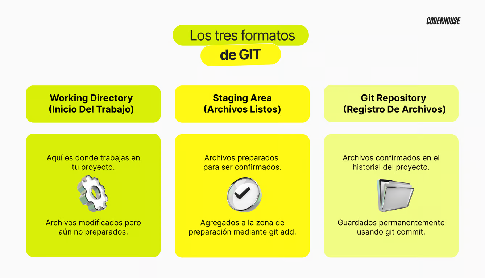

# 🎯 Git: estados, instalación y configuración

## ¿Qué es Git?
Git es un sistema de control de versiones gratuito y de código abierto. Fue diseñado para manejar proyectos de todos los tamaños de manera rápida y eficiente. Un sistema de control de versiones es una herramienta que registra los cambios realizados en un archivo o conjunto de archivos a lo largo del tiempo, permitiendo que puedas recuperar versiones específicas más adelante.

Git permite a los desarrolladores gestionar el historial de versiones de su código, facilitando la colaboración en equipo y mejorando la organización del desarrollo de software. Con Git, es posible revertir el código a estados anteriores, comparar cambios, y trabajar en múltiples funcionalidades a través de ramas (branches) sin interferir en el trabajo de otros desarrolladores

## Utilidad de Git
1. **Gestión de Proyectos**: Git es extremadamente útil para proyectos de desarrollo de software de cualquier tamaño. Ya sea que trabajes solo o en un equipo grande, Git ayuda a mantener un registro detallado de todas las modificaciones realizadas en tu proyecto.

2. **Colaboración**: Facilita la colaboración entre desarrolladores, permitiendo a varios miembros del equipo trabajar en paralelo sin conflictos. Esto se logra mediante la creación de ramas, donde cada desarrollador puede trabajar en su propia copia del código.

3. **Control de Versiones**: Con git podemos registrar todos los cambios, lo que permite a los desarrolladores revertir a versiones anteriores del código si es necesario. Esto es particularmente útil para corregir errores o comparar diferentes versiones del proyecto.

4. **Eficiencia y Velocidad**: Git está diseñado para ser rápido y eficiente. Las operaciones comunes son rápidas, y su arquitectura distribuida permite que cada desarrollador tenga una copia completa del historial del proyecto en su propio equipo.


**Componentes Claves de Git**
1. **Repositorio** (Repository): Es el lugar donde se almacenan todos los archivos y el historial de cambios del proyecto. Puede estar ubicado localmente en tu computadora o en un servidor remoto.

2. **Commit**: Es una instantánea del proyecto en un punto específico en el tiempo. Cada commit tiene un identificador único y contiene un mensaje que describe los cambios realizados.

3. **Rama** (Branch): Una rama es una línea de desarrollo independiente. La rama principal generalmente se llama "master" o "main", y a partir de ella se pueden crear otras ramas para desarrollar nuevas funcionalidades o corregir errores.

4. **Merge**: Es el proceso de combinar los cambios de diferentes ramas. Se utiliza para integrar el trabajo de distintas ramas en una sola.

5. **Pull Request**: Es una solicitud para revisar y fusionar los cambios de una rama en otra. Es una práctica común en proyectos colaborativos para asegurar que el código se revisa antes de integrarse en la rama principal.

👉 Git es una herramienta esencial en el desarrollo moderno de software, proporcionando un control detallado y eficaz sobre el proceso de desarrollo, facilitando la colaboración y mejorando la calidad del código.

## 🎯 Instalación y Configuración de Git
Veremos cómo instalar Git en su sistema y cómo realizar la configuración inicial, que incluye establecer su nombre de usuario y correo electrónico. Tener Git correctamente instalado y configurado es crucial para cualquier proyecto de desarrollo, ya que les permitirá llevar un control preciso de sus cambios y colaborar de manera eficiente con otros desarrolladores.

1. **Descargar el instalador**
    - Ve a https://git-scm.com/download/win.
    - Se descargará automáticamente la versión más reciente de Git para Windows.

2. **Ejecutar el instalador**
    - Abre el archivo .exe descargado y sigue los pasos del asistente de instalación.
    - Durante la instalación, deja las opciones predeterminadas a menos que necesites configuraciones específicas.

3. Verificar la instalación
    - Abre Git Bash o Símbolo del sistema (cmd) y escribe:
    ```
    git --version
    ```
    - Si ves una versión de Git impresa en la pantalla, significa que la instalación fue exitosa.

## 🎯 Configuración inicial (para todos los sistemas)
Después de instalar Git, configúralo con tu nombre y correo electrónico:
```
git config --global user.name "Tu Nombre"
git config --global user.email "tu@email.com"
```

Puedes verificar la configuración con:
```
git config --list
```



- Tutoriales: 
    - https://skills.github.com/
    - https://www.digitalocean.com/community/tutorials/how-to-use-git-integration-in-visual-studio-code-es