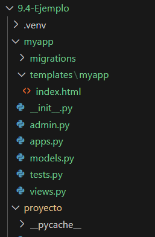

- **Pasos para crear el entorno virtual**: 
    - pip list
    - python -m venv .venv
    - .\.venv\Scripts\activate          
        - tiene que estar activo siempre para que funcione       
    - pip install django
    - django-admin startproject proyecto .
    - python manage.py migrate
        - crea la base de datos
    - python manage.py runserver
        - levanta el servidor

- **Si se quiere usar pipenv**
    - pip install pipenv

- **Resultado**:


- **Pasos para crear una aplicación**
    - python manage.py startapp myapp
    - Se registra en el archivo `settings.py` de la carpeta del proyecto
        ```python
            INSTALLED_APPS = [
                'django.contrib.admin',
                'django.contrib.auth',
                'django.contrib.contenttypes',
                'django.contrib.sessions',
                'django.contrib.messages',
                'django.contrib.staticfiles',
                'myapp', # Se añade la aplicación creada
            ]
        ```

    - Crear carpeta templates, dentro carpeta con el mismo nombre de la app y luego el index.html
    

    - En el archivo `views.py` se crea las vistas
    ```python
    def index(request):
        context = {"mensaje": "Hola Mundo!, bienvenida a mi aplicación de Django"}
        return render(request, "myapp/index.html", context)
    ```
    - En el archivo `urls.py`,  de la carpeta proyecto
    ```python
    from myapp import views

    urlpatterns = [
        path('admin/', admin.site.urls),
        path('prueba/', views.index, name='index'),
    ]
    ```

    - Levantar el proyecto con `python manage.py runserver`
        - http://127.0.0.1:8000/prueba/


